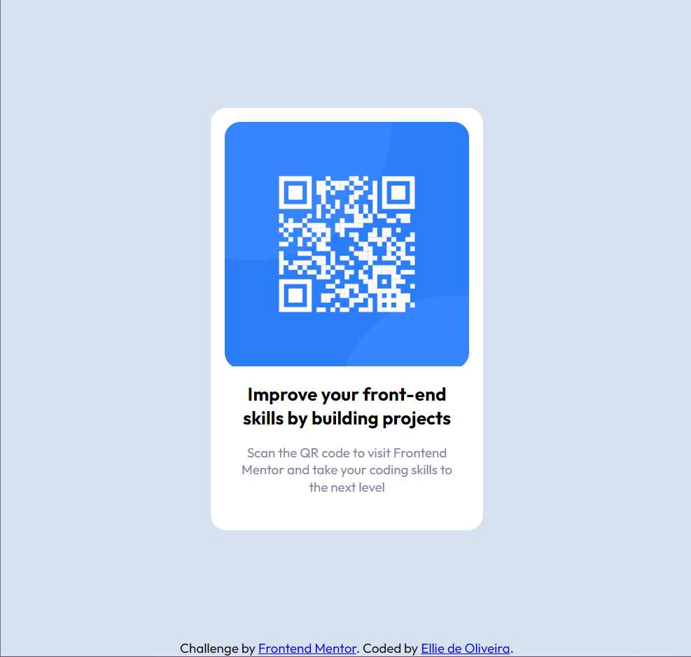

# Frontend Mentor - QR code component solution

This is a solution to the [QR code component challenge on Frontend Mentor](https://www.frontendmentor.io/challenges/qr-code-component-iux_sIO_H). Frontend Mentor challenges help you improve your coding skills by building realistic projects.

## Table of contents

- [Frontend Mentor - QR code component solution](#frontend-mentor---qr-code-component-solution)
  - [Table of contents](#table-of-contents)
  - [Overview](#overview)
    - [Screenshot](#screenshot)
    - [Links](#links)
  - [My process](#my-process)
    - [Built with](#built-with)
    - [What I learned](#what-i-learned)
    - [Continued development](#continued-development)
    - [Useful resources](#useful-resources)
  - [Author](#author)

**Note: Delete this note and update the table of contents based on what sections you keep.**

## Overview

### Screenshot



### Links

- Solution URL: [Repo](https://github.com/Ellie-A-Oliveira/qr-code-component-frontendmentor)
- Live Site URL: [GH-Pages](https://ellie-a-oliveira.github.io/qr-code-component-frontendmentor/)

## My process

### Built with

- Semantic HTML5 markup
- CSS custom properties
- Flexbox
- CSS Grid
- Mobile-first workflow

### What I learned

I learned more about semantic HTML, including better structuring and accessibility. I found out that custom properties on ```:root``` don't apply to font-faces.

One of the interesting things I'm trying to develop is how to think of building the css for shared components to be able to better utilize them, and this project helped me better think of my css for this use.

### Continued development

I want to keep improving my components' css in order to be able to make easy-to-use tools.

### Useful resources

- [meyerweb.com](https://meyerweb.com/eric/tools/css/reset/) - Thanks to MeyerWeb for the css reset.
- [mdn web docs - article](https://developer.mozilla.org/en-US/docs/Web/HTML/Element/article) - MDN has awesome documentation, this one helped me better structure my HTML.

## Author

- Github - [Ellie-A-Oliveira](https://github.com/Ellie-A-Oliveira)
- Frontend Mentor - [@Ellie-A-Oliveira](https://www.frontendmentor.io/profile/Ellie-A-Oliveira)
